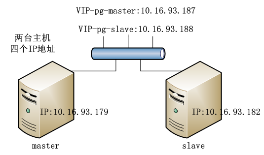

# pg-ha
postgresql HA based on pacemaker.

该项目是postgresql双机热备、主从同步方案的部署脚本。该方案中使用pacemaker+corosync组件完成pg的高可用。

详细的部署说明文档，请看博客：

[postgresql双机热备、高可用方案（采用pacemaker+corosync实现）](http://blog.csdn.net/qguanri/article/details/51151974)

网络拓扑：


# 部署脚本

## postgresql高可用自动部署脚本

两台主机，分别为master、slave。请先将IP、网段、数据目录等实际使用的配置填入文件ha.conf。请在root账户下执行。

**请严格按照如下顺序执行,否则将出错**

### （1）在master、slave上安装pacemaker。

```
$ sh install_pacemaker.sh
```

### （2）在master上初始化数据库。

```
$ sh install_pg_master.sh
```

### （3）在slave上配置数据库。

```
$ sh install_pg_slave.sh
```

### （4）在master上配置故障切换。

```
$ sh auto_change.sh
```

### （5）在master/slave上验证结果。

```
$ sh check_pg.sh
```
